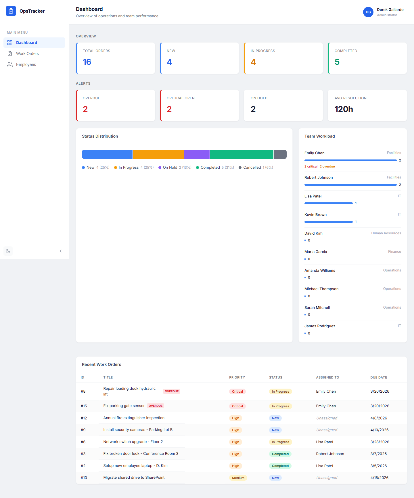
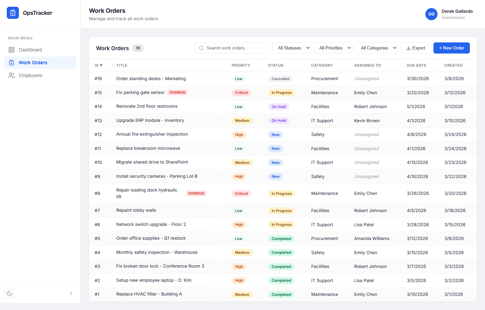
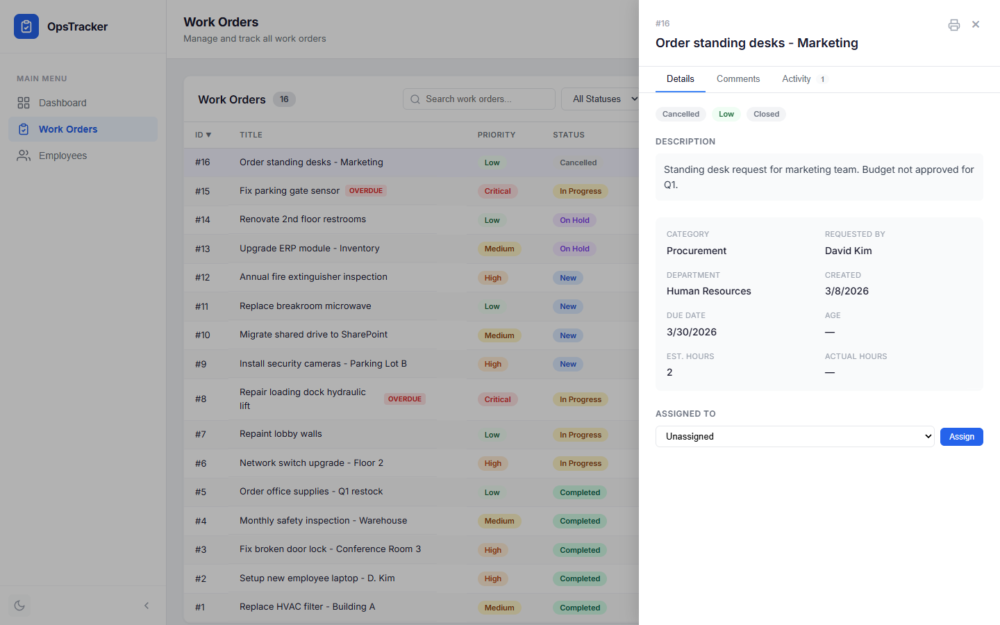
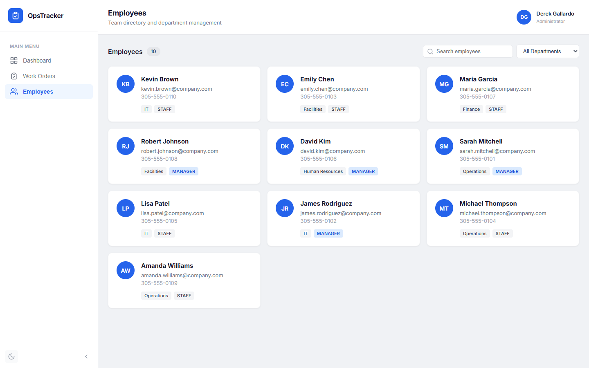
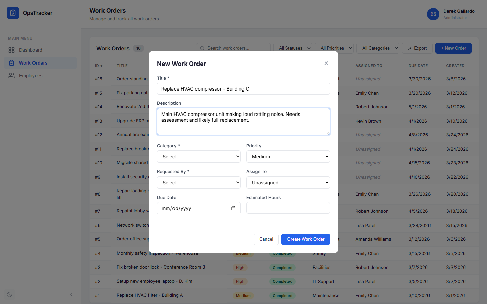
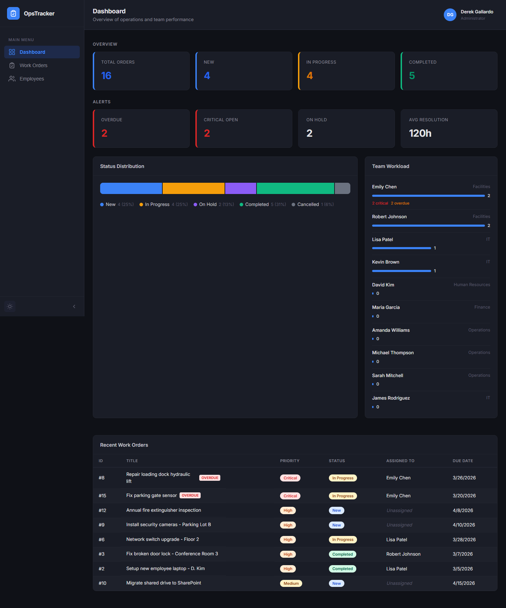
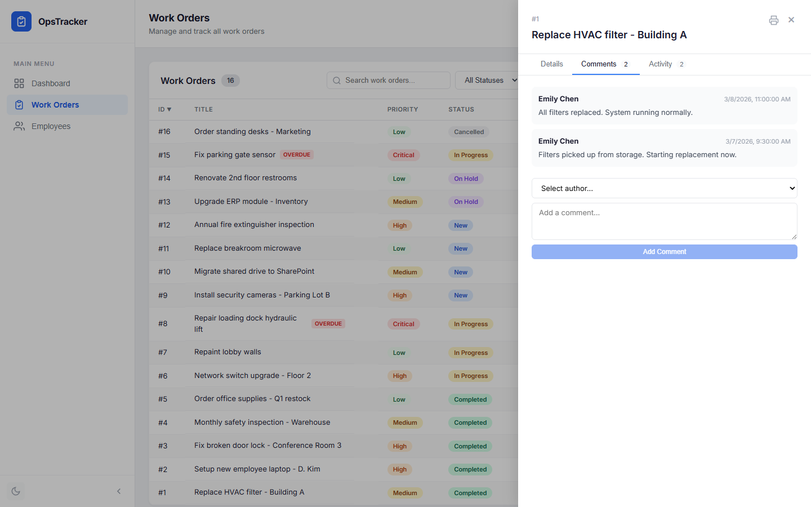
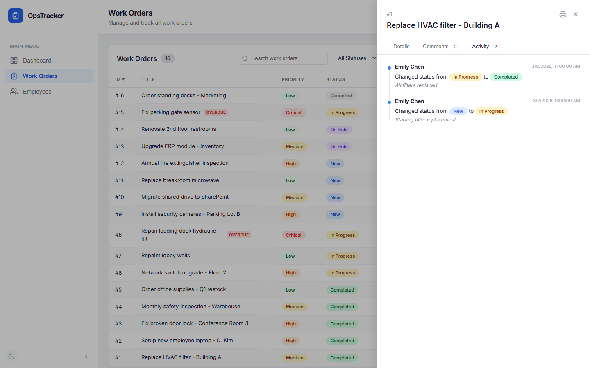

# Business Operations Tracker

[](https://github.com/derekgallardo01/business-operations-tracker/actions/workflows/ci.yml)

A full-stack work order management system for tracking business operations, built with .NET 8, React, and Azure SQL. Features real-time updates via SignalR, dark mode, and a corporate sidebar layout.



## Screenshots

| Dashboard | Work Orders | Detail Panel |
|-----------|-------------|--------------|
|  |  |  |

| Employees | New Work Order | Dark Mode |
|-----------|---------------|-----------|
|  |  |  |

| Comments | Activity Log |
|----------|-------------|
|  |  |

## Features

- **Dashboard** — real-time metrics, status distribution chart, team workload visualization
- **Work Order Management** — create, assign, update status, log hours, add comments
- **Status Workflow** — enforced transitions (New → In Progress → Completed) with full audit trail
- **Activity Log** — complete status change history with timeline view
- **Employee Directory** — searchable team directory with department filtering
- **Search & Filtering** — text search, status/priority/category filters, sortable columns
- **CSV Export** — export filtered work orders to CSV
- **Print View** — print-friendly work order reports
- **Dark Mode** — theme toggle with localStorage persistence
- **Real-Time Updates** — SignalR WebSocket pushes refresh all connected clients instantly
- **Responsive** — mobile-friendly layout with collapsible sidebar

## Tech Stack

| Layer | Technology |
|-------|-----------|
| **Frontend** | React 18, TypeScript, CSS Variables |
| **Backend** | .NET 8, ASP.NET Core, Dapper, SignalR |
| **Database** | Azure SQL / SQL Server |
| **Auth** | Azure Managed Identity |
| **CI/CD** | GitHub Actions |
| **Containerization** | Docker, docker-compose |

## Architecture

```
┌──────────────┐     ┌──────────────┐     ┌──────────────────┐
│   React UI   │────▶│  .NET 8 API  │────▶│  Azure SQL / SQL  │
│  Port 3000   │     │  Port 5138   │     │     Server        │
│              │     │              │     │                    │
│  Dashboard   │     │  Controllers │     │  Tables (7)        │
│  Work Orders │     │  Middleware   │     │  Views (4)         │
│  Employees   │     │  Validation  │     │  Stored Procs (6)  │
│  Dark Mode   │     │  Swagger UI  │     │  Indexes (10)      │
└──────────────┘     └──────────────┘     └──────────────────┘
```

## Quick Start

### Option 1: Docker (recommended)

```bash
git clone https://github.com/derekgallardo01/business-operations-tracker.git
cd business-operations-tracker
docker-compose up
```

Open http://localhost:3000 — the database is automatically created and seeded.

### Option 2: Manual Setup

**Prerequisites:** .NET 8 SDK, Node.js 20+, SQL Server (or Azure SQL with `az login`)

```bash
# API
cd api/OperationsTracker.Api
dotnet run

# UI (separate terminal)
cd ui
npm install
npm start
```

API: http://localhost:5138/swagger | UI: http://localhost:3000

### Run Tests

```bash
dotnet test
```

## API Endpoints

### Work Orders
| Method | Endpoint | Description |
|--------|----------|-------------|
| `GET` | `/api/workorders` | List work orders (filters: status, priority, categoryId, assignedToId, overdueOnly) |
| `GET` | `/api/workorders/{id}` | Get work order details |
| `POST` | `/api/workorders` | Create work order |
| `PUT` | `/api/workorders/{id}/status` | Update status (with audit trail) |
| `PUT` | `/api/workorders/{id}/assign` | Assign to employee |
| `POST` | `/api/workorders/{id}/hours` | Log hours worked |
| `GET` | `/api/workorders/{id}/comments` | Get comments |
| `POST` | `/api/workorders/{id}/comments` | Add comment |
| `GET` | `/api/workorders/{id}/history` | Get status change history |

### Dashboard
| Method | Endpoint | Description |
|--------|----------|-------------|
| `GET` | `/api/dashboard/metrics` | Aggregate metrics (counts, overdue, avg resolution) |
| `GET` | `/api/dashboard/workload` | Team workload breakdown |

### Employees, Categories, Departments
| Method | Endpoint | Description |
|--------|----------|-------------|
| `GET` | `/api/employees` | List employees |
| `GET` | `/api/employees/{id}` | Get employee |
| `POST` | `/api/employees` | Create employee |
| `GET` | `/api/categories` | List categories |
| `GET` | `/api/departments` | List departments |

## Project Structure

```
business-operations-tracker/
├── .github/workflows/ci.yml        # CI/CD pipeline
├── api/
│   ├── OperationsTracker.Api/       # .NET 8 Web API
│   │   ├── Controllers/             # REST endpoints
│   │   ├── Models/                  # DTOs with validation
│   │   ├── Middleware/              # Global error handling
│   │   └── Program.cs              # App configuration
│   ├── OperationsTracker.Tests/     # xUnit tests (21 tests)
│   └── Dockerfile
├── ui/
│   ├── src/
│   │   ├── components/
│   │   │   ├── common/              # Toast, Modal, ErrorBoundary, ThemeToggle
│   │   │   ├── dashboard/           # Metrics, charts, workload
│   │   │   ├── workorders/          # List, detail panel, create modal
│   │   │   └── employees/           # Card grid with search
│   │   ├── api.ts                   # API client
│   │   └── App.tsx                  # Root component
│   ├── Dockerfile
│   └── nginx.conf
├── database/
│   ├── 001-create-tables.sql        # 7 tables with constraints
│   ├── 002-create-indexes.sql       # 10 performance indexes
│   ├── 003-create-views.sql         # 4 analytics views
│   ├── 004-seed-data.sql            # Sample data (16 work orders)
│   └── 005-stored-procedures.sql    # 6 stored procedures
├── docker-compose.yml               # Full stack: SQL + API + UI
└── business-operations-tracker.sln
```

## Database Schema

**Tables:** Departments, Employees, Categories, WorkOrders, Comments, Attachments, StatusHistory

**Key Views:**
- `vw_WorkOrders` — enriched work orders with calculated fields (age, overdue status)
- `vw_DashboardMetrics` — aggregate counts and average resolution time
- `vw_TeamWorkload` — per-employee assigned orders, critical items, overdue count

## Azure Infrastructure

| Resource | Name |
|----------|------|
| Resource Group | `rg-operations-tracker` |
| App Service | `rg-operations-tracker-app` |
| SQL Server | `rg-operations-tracker-server-2` |
| SQL Database | `rg-operations-tracker-sql-db` |

The API uses **Managed Identity** — no passwords in config. The App Service's system-assigned identity has `db_datareader` and `db_datawriter` roles.
